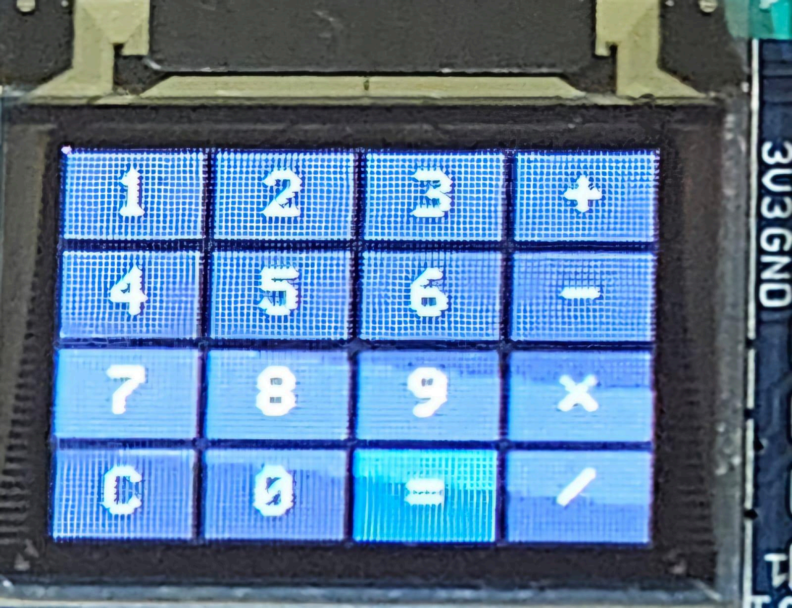
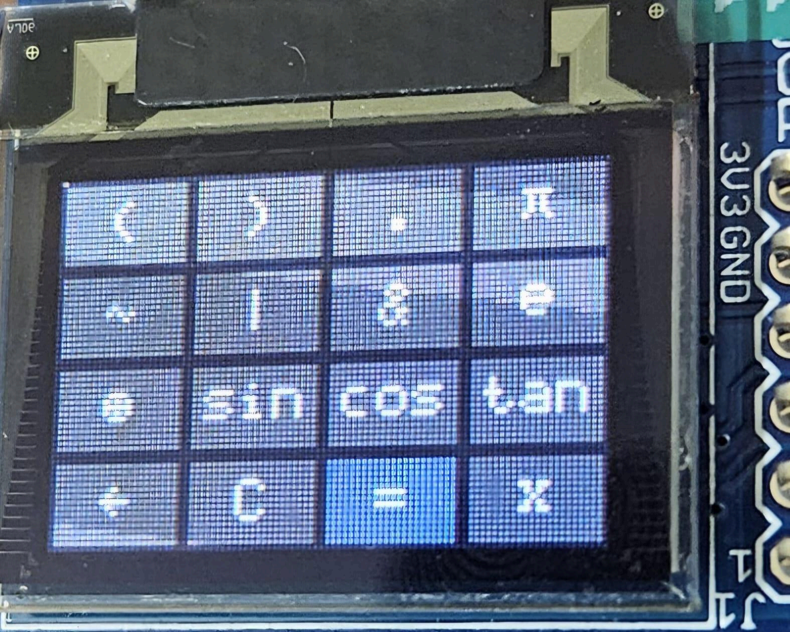
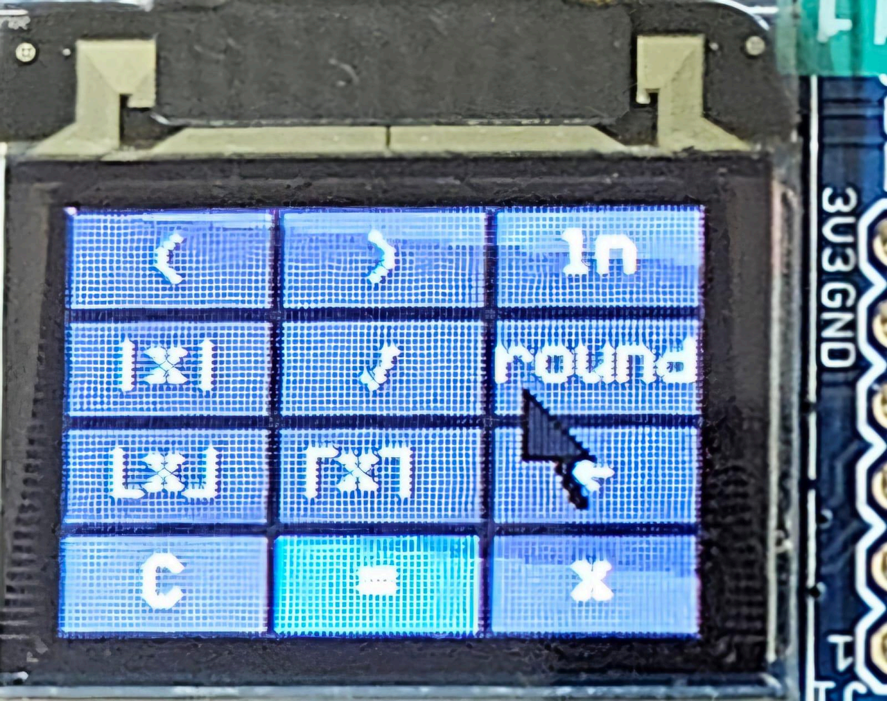
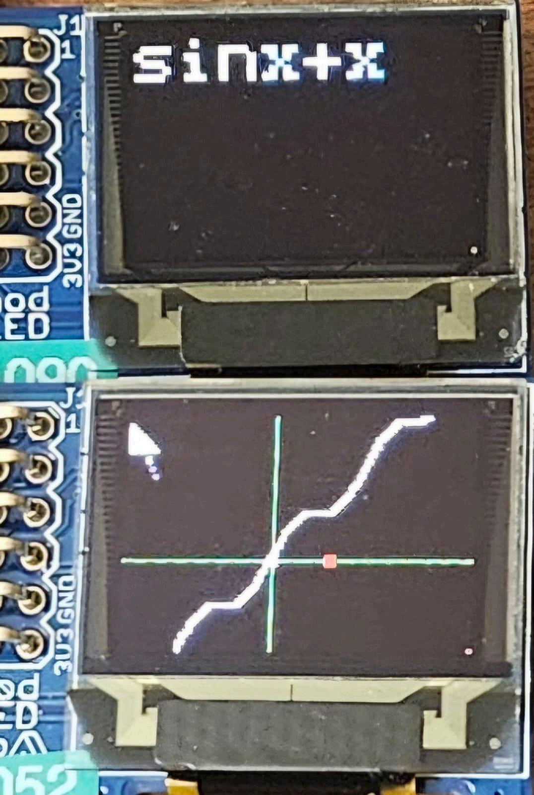
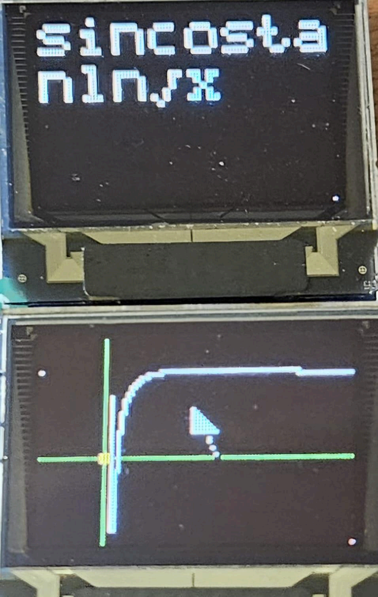
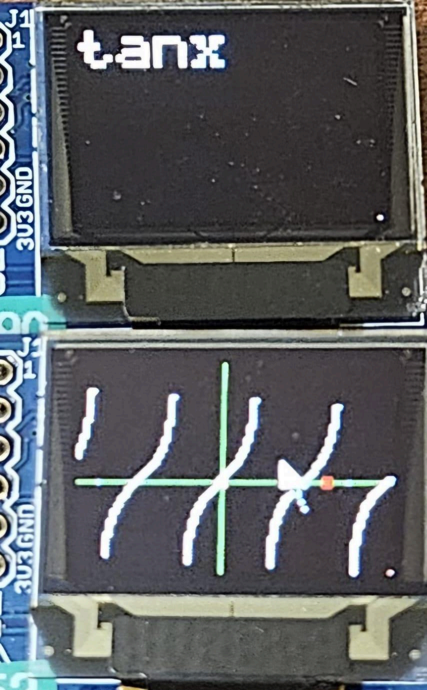
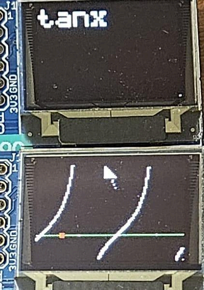

# Freeform Verigraph Calculator

**Freeform Verigraph Calculator** is a fully‑featured graphing calculator built on the **Basys 3** FPGA board with 3 **OLED**. It combines colour‑coded keypad/text/graphic displays, a responsive PS/2 mouse interface and a powerful fixed‑point math core to evaluate and plot mathematical expressions in real time. The project demonstrates how to implement computation of free‑form input (not just pre‑programmed functions), from automatic parsing, calculating, plotting of expressions with variable `x`, to intuitive graph navigation using verilog on FPGA.

## Overview

The calculator comprises three major subsystems:

1. Input subsystem – A keypad containing three pages and text OLED allow expressions to be entered character by character. Buttons are debounced and auto‑repeat is supported. A PS/2 mouse can also click keypad buttons or drag the graph. Mouse scroll switch pages in keypad mode and zoom in/out graph in graph mode. Tokens are colour‑coded (numbers, functions, variables, constants, brackets and operators) for readability and the display automatically expands function keys into their ASCII names.

    - Three keypad pages
     
     
    

1. Expression evaluation – Expressions are tokenised and converted from infix to Reverse Polish Notation (RPN) using a shunting‑yard algorithm. The tokenizer automatically inserts missing closing parentheses at the end of an expression and recognises numbers, the variable `x`, `π` and `e`. Once in RPN, a set of Q16.16 fixed‑point math modules evaluate the expression with support for arithmetic, trigonometric, logarithmic, bitwise and power operations.

1. Graph plotter – When `=` is pressed, the system also enters graph mode. It samples the function across the OLED’s width, maps world coordinates to screen pixels and draws axes, unit markers and the curve. A viewport controller handles zooming and panning: zoom in/out multiplies or divides the view and recentres offsets, mouse drags translate the graph, and arrow buttons provide discrete pans. A middle mouse click toggles between keypad and graph control.

    - examples
    
    
    
    

All subsystems are integrated by a compute link module that detects whether an expression contains the symbol x and accordingly switches between numeric evaluation and graph evaluation. Pressing = triggers a soft reset of the parser and math modules, ensuring that each computation starts from a clean state.

## Hardware Requirements

- Board: Digilent Basys 3 FPGA (Artix‑7 XC7A35T)

- Display: Digilent Pmod OLED * 3 (96 × 64 pixels, 16‑bit colour)

- Input devices: On‑board pushbuttons (Up, Down, Left, Right, Centre), 16 slide switches and a PS/2 mouse

## Building the Project

1. **Install Vivado** – The design targets Vivado 2018.3. Any later Vivado release can import the project, but the supplied constraints were tested with the 2018 version.

1. **Clone this repository** – All source files live under FDP.srcs/. Open the FDP.xpr project in Vivado or create a new project and add the design sources and constraint file.

1. **Generate the bitstream** – Run synthesis and implementation, then generate the bitstream. Alternatively, check the releases section for a pre‑built .bit file and Vivado project archive.

1. **Program the board** – Connect the Basys 3 via USB. In Vivado’s hardware manager, select the FPGA device and program it with the generated bitstream. Attach the Pmod OLED to JA, JB and JC as configured in the constraints and connect a mouse to the PS/2 port.

## Using the Calculator

### Entering expressions

When caculator starts the user can directly "type" the math expression using keypad. Use the arrow buttons to navigate between keys, `BTN C` to select a key and `BTN L`/`BTN R` for backspace and clear. Alternatively, use the mouse to click on keypad buttons. The keypad includes digits, operators (`+`, `−`, `×`, `/`, bitwise `|`, `~`, `&`, `⊕`), parentheses, trigonometric functions (`sin`, `cos`, `tan`), logarithms (`ln`), square root, absolute value and floor, ceil, round. Constants `π` and `e` are also available. Tokens are coloured according to their type following vscode color palette, and function keys automatically expand into their full names. When you press `=`, the system will automatically append any missing closing parentheses `)`.

### Evaluating results

Press the `=` key (or the corresponding button) to compute the expression. The compute link resets the evaluator, tokenizes the expression, converts it to RPN and then executes each token using the math modules. If the expression contains no `x`, a numeric result appears on the text display. The Q16.16 result is converted to ASCII with up to three decimal places. No matter whether the expression contains `x`, the calculator enters graph mode.

### Plotting graphs

In graph mode the system samples the expression across the horizontal axis and plots the curve on the graph OLED. Axes cross at the world origin and unit markers are drawn. Use the mouse scroll wheel to zoom in and out; the zoom exponent is bounded to prevent overflow. Drag the graph with the left mouse button to pan in both directions. Arrow buttons can also pan the graph when the button_for_graph switch (`sw[13]`) is set; enabling `sw[14]` allows zooming using the Up/Down buttons. A middle mouse click toggles whether the mouse controls the keypad or the graph. Graph evaluation runs concurrently with rendering: each x‑sample is passed to the evaluator, and valid y‑values are mapped to pixels via a viewport controller that scales and translates coordinates. Invalid samples (e.g. division by zero) are skipped to avoid spurious vertical lines.

## Resets and error handling

- **Soft reset**: Switch 15 (`sw[15]`) resets all modules – the input buffer, evaluator, converter and math cores. This is useful if the system becomes unresponsive. The compute link also performs a soft reset whenever `=` is pressed to ensure stale state does not contaminate new calculations. At this stage we have tested the calculator for various inputs and none of them could run into invalid state where we have to use `sw[15]`, however it is still useful to reset the graph pan position.

- **Clear input**: A dedicated clear key resets the input buffer and graph without resetting the whole system.

- **Expression errors**: The tokenizer and evaluator set error flags for syntax errors, divide by zero, negative inputs to sqrt, underflow or overflow. Errors are recorded but display of errors are not implemented for now.

## Repository Structure
```text
FDP.srcs/
  └─ sources_1/
     ├─ new/
     │  ├─ Top_Student.v        # Top‑level module wiring together all blocks
     │  ├─ buttons.v            # Button debouncer and navigation with auto‑repeat
     │  ├─ clock_devider.v      # Generates slower clocks (25 MHz, 6.25 MHz, 1 kHz)
     │  ├─ constants.vh         # Token codes, operator/function IDs, colours and Q16.16 constants
     │  ├─ convert.v            # String ↔︎ Q16.16 converters (decimal parser and 3‑decimal formatter)
     │  ├─ evaluate.v           # Top‑level expression evaluator: tokenizer → shunting yard → RPN evaluator
     │  ├─ font.v               # 5×7 ASCII font ROM for text rendering
     │  ├─ graphic.v            # Graph plotting core: viewport control, range planning, point mapping and OLED renderer
     │  ├─ input_core.v         # Input system: text buffer, token‑to‑ASCII decoder and colour assignment
     │  ├─ integrate.v          # Compute link: orchestrates evaluation, numeric/graph mode switching and buffer loading
     │  ├─ keypad.v             # Keypad focus grid, mapping from row/column to token codes and keypad rendering
     │  ├─ math.v               # Q16.16 arithmetic modules: add, subtract, multiply, divide, power, exp/ln/log10, trig functions, sqrt and bitwise ops
     │  ├─ mouse.v              # Mouse interface: PS/2 wrapper, cursor drawing, drag detection and middle‑click mode switch
     │  ├─ parse.v              # Tokenizer (auto closing parentheses, constants and variable detection) and shunting‑yard parser
     │  ├─ render.v             # OLED controller, text grid renderer, keypad renderer and text OLED wrapper
     │  ├─ uart.v               # UART transmitter/receiver (unused in this design)
     │  └─ utils.v              # Utility functions (e.g. int32 to ASCII converter)
     └─ ... (other Vivado project files)
```

## High‑level connections


`Top_Student.v` instantiates a clock divider and debounced navigation keys; it routes the slide switches to reset (`sw[15]`), zoom‑by‑button enable (`sw[14]`) and arrow‑button graph mode (`sw[13]`). The PS/2 mouse is wrapped by mouse_wrapper to produce pixel coordinates and button events. A mouse_mode_switch toggles which subsystem receives mouse input based on the middle button. student_input drives the keypad and text OLED, while graph_plotter_core draws graphs on a separate OLED. Both are connected through a compute link (`compute_link`) that handles evaluation requests and graph sampling.

`input_core.v` contains a `text_buffer` for storing the current expression, a `token_to_ascii_decoder` that converts tokens to displayable ASCII and applies colour coding to each character, and a `keypad_widget` that draws the keypad and interprets navigation clicks.

`parse.v` defines the tokenizer and shunting‑yard parser. During scanning it counts opening and closing parentheses; if the expression ends with unmatched opens, it automatically emits the required number of closing parentheses. It also recognises digits, decimal points, variable x, the pi and e constants, and special function keys.

`math.v` implements fixed‑point arithmetic and transcendental functions. Division uses a restoring algorithm with saturation, exponentials and logarithms use range reduction and polynomial/CORDIC approximations, trigonometric functions rely on a CORDIC engine, and square roots use Newton–Raphson iteration. Error flags propagate upward for invalid operations.

`graphic.v` contains the core of graph plotting. The `viewport_ctrl` updates zoom and pan offsets on every clock; zoom in/out shifts the offsets and clamps the exponent to a safe range while mouse drags apply world‑space translation. `range_planner` converts the viewport into an x‑range and step for sample generation, and `mapper_plot_points` maps Q16.16 world coordinates to pixel positions, draws axes, unit markers, and the origin, and updates stored `y` coodinates.

## License

This project is licensed under the MIT License. See the LICENSE file for details